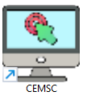
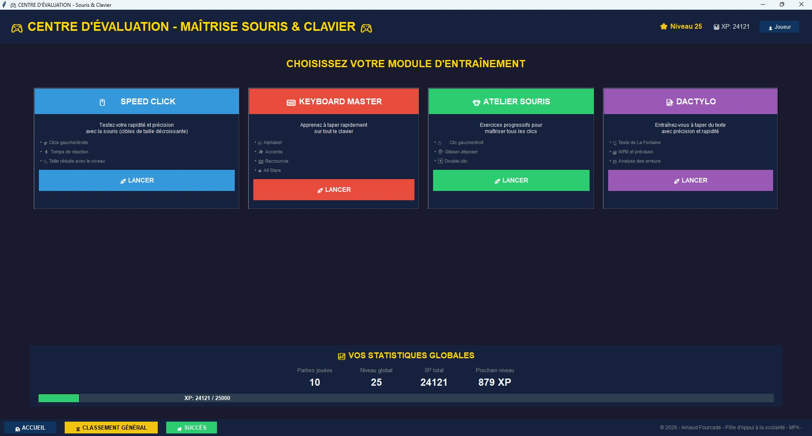

# 🎮 Centre d'Évaluation - Maîtrise Souris & Clavier

**Centre d'Évaluation** est un logiciel éducatif gratuit pour apprendre et améliorer la maîtrise du clavier et de la souris.  
Destiné aux débutants comme aux utilisateurs avancés, il propose 4 modules d'entraînement ludiques avec suivi des progrès.

---

## 📥 Téléchargement

👉 **[Télécharger CEMSC.zip](../../releases/latest/download/CEMSC.zip)** (lien direct)

> **IMPORTANT :** Après avoir téléchargé le fichier ZIP, vous devez **le décompresser** avant utilisation.  
> Windows ne peut pas lancer le raccourci directement depuis l'archive.

---

## 🚀 Installation et lancement

1. **Décompressez** `CEMSC.zip` (clic droit → "Extraire tout…").
2. Ouvrez le dossier `CentreEvaluation`.
3. Double-cliquez sur **`CEMSC.exe`** (ou sur le raccourci fourni).
4. Si Windows SmartScreen vous alerte, cliquez sur **"Informations complémentaires"** puis **"Exécuter quand même"**.

### 📌 Épingler sur le Bureau

Vous pouvez **déplacer le raccourci** (`CEMSC.exe - Raccourci`) sur votre Bureau pour un accès rapide.  
Vous pouvez aussi créer un nouveau raccourci : clic droit sur `CEMSC.exe` → **Envoyer vers** → **Bureau (créer un raccourci)**.

---

## 📁 Contenu de l'archive

| Fichier | Description |
|---------|-------------|
| `CEMSC.exe` | Programme principal (portable, aucune installation) |
| `CEMSC.exe - Raccourci` | Raccourci Windows avec icône (peut être déplacé) |

---

## 🎯 Modules disponibles

- **🖱️ Speed Click** – Rapidité et précision de la souris (cibles gauche/droite, taille décroissante).
- **⌨️ Keyboard Master** – Frappe au clavier : lettres, accents, ponctuation, raccourcis et mode All Stars.
- **🐭 Atelier Souris** – Exercices de base : clic gauche, droit, double‑clic, glisser‑déposer.
- **📝 Dactylo** – Saisie de texte avec analyse WPM, précision et erreurs détaillées.

---

## ✨ Fonctionnalités

- 👥 **Profils multiples** – Chaque utilisateur dispose de son propre suivi.
- 🏆 **Succès & Badges** – Débloquez des récompenses en progressant.
- 📊 **Statistiques avancées** – Heatmap du clavier, précision, classement général.
- 🎨 **Interface moderne** – Thème sombre, animations et mode plein écran (F11).
- 💾 **Sauvegarde automatique** – Données stockées dans `%LOCALAPPDATA%\CentreEvaluation`.

---

## 💻 Configuration minimale

- Windows 10 ou 11
- 2 Go de RAM
- Résolution 1024×768
- **Aucune installation requise** (logiciel portable)

---

## 📸 Aperçu

---

## 🛠️ Signaler un problème

Si vous rencontrez un bug ou avez une suggestion, ouvrez une [issue](../../issues) sur ce dépôt.

---

© 2026 Arnaud Fourcade – Pôle d'Appui à la scolarité – MPA
